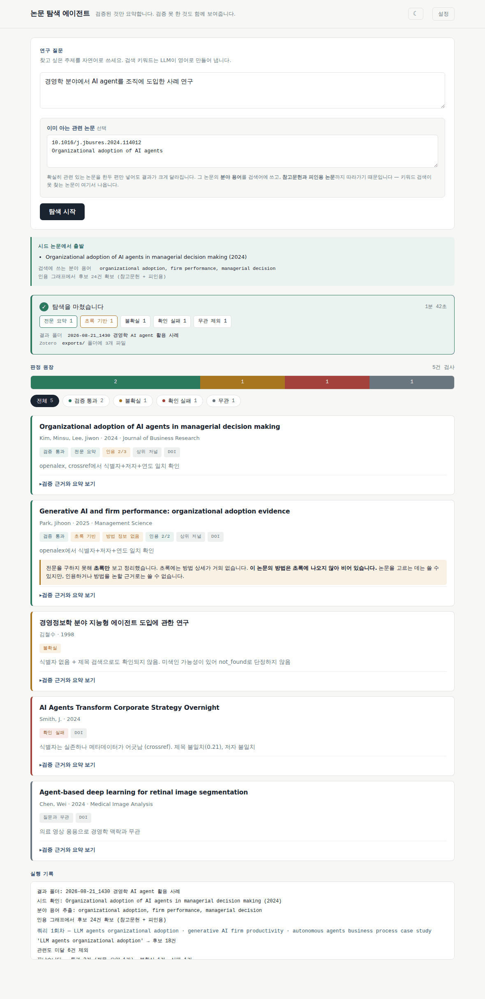
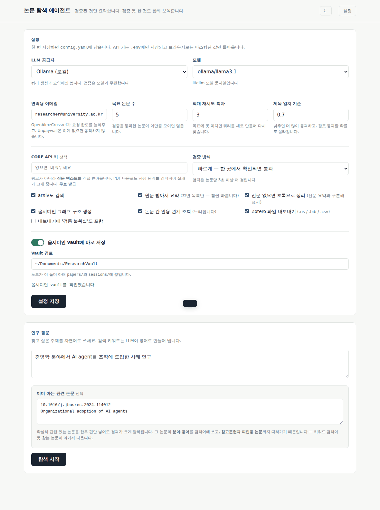
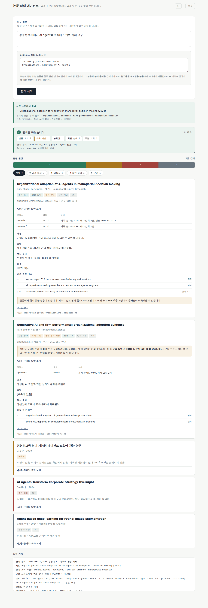
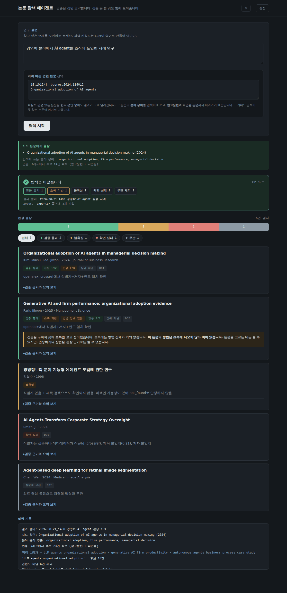

<div align="right">

[한국어](README.ko-KR.md) · **English**

</div>

# paper-research-agent

A research assistant that refuses to hallucinate papers.

It filters out papers that don't exist, and summarizes **only** the ones whose full text it actually obtained — writing results to Obsidian notes and Zotero files.

```bash
git clone https://github.com/<your-account>/paper-research-agent.git
cd paper-research-agent
python server.py     # or double-click start.bat
```



*Verified, uncertain, not-found, and off-topic are visually distinct. Failures stay visible, with reasons.*

> **Note on language:** the interface is currently Korean-only. The screenshots reflect that. All configuration keys, code, and prompt files are documented here in English.

---

## Why this exists

Ask an LLM to "find papers about X" and some of what comes back doesn't exist.

The second failure is worse. Even for a paper that *does* exist, asking for a summary without the full text makes the model invent plausible content from the title and authors alone. And because existence was confirmed, **people trust it more.**

This tool blocks both.

---

## Pipeline

```
        ┌──────────────────────────────────┐
        │  [0] question  +  [0-1] seeds     │
        │  field vocabulary, citation graph │
        └────────────────┬─────────────────┘
                         ▼
        ┌──────────────────────────────────┐
        │  [1] query expansion    (LLM)     │
        │  [2] search  OpenAlex · arXiv     │
        │      + seed references / citers   │
        └────────────────┬─────────────────┘
                         ▼
        ┌──────────────────────────────────┐
        │  [2-1] relevance scoring  (LLM)   │
        │  score against question, re-rank  │
        └────────────────┬─────────────────┘
                         ▼
        ┌──────────────────────────────────┐
        │  [3] existence check     (code)   │
        │  identifier + authors + year      │
        └───┬────────────┬─────────────┬───┘
            │            │             │
     verified│    not_found│    uncertain│
            │            ▼             ▼
            │      recorded with   recorded with
            │      ~~strikethrough~~  "verify manually"
            ▼
        ┌──────────────────────────────────┐
        │  [4] venue tier   SJR · CORE      │
        └────────────────┬─────────────────┘
                         ▼
        ┌──────────────────────────────────┐
        │  [5] fetch full text     ☑ toggle │
        └───┬──────────────────────────┬───┘
          on│                       off│
            ▼                          ▼
   ┌──────────────────┐      ┌──────────────────┐
   │ CORE (text)      │      │  list only        │
   │  → OA link → PDF │      │  metadata + OA    │
   └───┬──────────┬───┘      │  much faster      │
       │          │          └─────────┬────────┘
   got it│    no text│                    │
       ▼          ▼                    │
┌────────────┐ ┌──────────────────┐    │
│ [7] summary │ │ [7-A] abstract    │    │
│ [7-1] quote │ │  ⚠ marked distinct│    │
│  page check │ │  method gap noted │    │
└──────┬─────┘ └─────────┬────────┘    │
       └────────┬────────┴─────────────┘
                ▼
   ┌──────────────────────────────────────┐
   │  vault/2026-08-21_1430 question/      │
   │    _question.md    summary + triage   │
   │    papers/         one note per paper │
   │    keywords/       graph hubs         │
   │    exports/        .ris .bib .csv     │
   └──────────────────────────────────────┘
```

**Every run gets its own folder.** Piling results into one directory makes it impossible to tell which paper came from which question.

The LLM is involved at **three points only** — [1], [2-1], and [7]. Everything else is API calls or deterministic code, so verification quality doesn't degrade when you run a small local model.

---

## Principles

### 1. Verify first

An identifier isn't enough. Forged entries reuse a real DOI and swap the title and authors, so the check always requires **identifier + authors + year** together.

### 2. Full text or nothing

Summaries come from full text. When only an abstract is available, the result is marked `abstract_only` and the note carries a visible warning that method details are missing.

### 3. Failures stay visible

Everything that wasn't found, wasn't summarized, or failed verification is shown. **Nothing is dropped silently.**

### 4. Model-agnostic

OpenAI, Anthropic, Gemini, and Ollama all work with no extra packages.

---

## Verification verdicts

The most important part of this tool.

| Status | Meaning | When |
|---|---|---|
| `verified` | Identifier, authors, and year all match an index | Passes |
| `uncertain` | **Cannot determine** | API outage, not indexed, no identifier |
| `not_found` | An index explicitly said it doesn't exist | Confirmed absent |

**Separating `uncertain` from `not_found` is the whole point.**

- Treat an API outage as `not_found` → **every paper looks fake the day your network breaks**
- Treat "not indexed" as `not_found` → **non-English, humanities, and older papers get wiped out**

So "couldn't confirm" and "fabricated" are never conflated.

Conversely, when an identifier **is** real but the title and authors don't match (`mismatch`), that's treated as a *stronger* fabrication signal than plain absence, and judged `not_found`.

---

## Screens

### Settings — everything in one place



Fill in your email and a save path; the rest can stay at defaults.

**If runs feel slow, turn off "fetch full text."** PDF downloads (up to 60s per paper) and summarization (up to 180s) dominate the runtime. When you only want to know whether a search is worth pursuing, list-only mode is far faster. Turn it back on and re-run the same question once you're satisfied.

### Results — failures included



Expanding a card shows **per-index lookup results** and **quote verification**. Quotes that couldn't be found in the source stay visible as `failed 0.31` — removing them silently would make the summary look fully verified when it isn't.

### Dark mode



Toggle with the ☾ button in the header. Defaults to your system setting; your choice is remembered once you pick one.

---

## Install

### Requirements

- **Python 3.10+**
- **One LLM** — Ollama (free, local) or an API key
- Internet (OpenAlex, Crossref, arXiv, Unpaywall — all free, no key needed)

### Run

| OS | How |
|---|---|
| Windows | double-click `start.bat` |
| macOS | `chmod +x start.command`, then double-click |
| Linux | `bash start.command` |

The launcher finds Python, installs missing packages, starts the server, and opens a browser. Installation happens once.

To run it directly:

```bash
pip install -r requirements.txt
python server.py          # web UI
python main.py "question" # CLI
```

If port 8765 is taken it moves to the next free one.

### First setup

Fill in **email** and **save path**. The email raises rate limits at OpenAlex and Crossref, and Unpaywall won't respond without it.

---

## Why a local server, not just HTML

A standalone HTML file can't do three things:

1. **Fetch PDFs** — CORS blocks reading responses from arbitrary servers. Open-access PDFs live across hundreds of repositories that have no reason to send CORS headers. Without full text, principle 2 collapses.
2. **Write files** — a browser can't save into your Obsidian vault.
3. **Hold keys safely** — API keys in the browser are readable by extensions and devtools.

The local server solves all three, and nothing leaves your machine. It binds to `127.0.0.1` by default.

---

## Features

### Seed papers

Give it a paper you know is relevant — DOI or title — and it will:

- extract the **actual vocabulary of that field** (`organizational adoption`, `firm performance`) and use it in queries
- follow **references and citing papers**, which surfaces work that keyword search never reaches

If the title doesn't match closely enough it reports "not found" rather than **guessing**. A wrong seed skews the entire search.

### Full text acquisition

```
CORE (text directly) → OpenAlex → arXiv → Unpaywall → Semantic Scholar
```

CORE returns **full text in the API response**, not a link — which skips the download and parsing stages entirely, removing two places things can fail. It harvests from 10,000+ institutional repositories, where author-accepted manuscripts of paywalled papers often live.

When an OA link points at a landing page, the `citation_pdf_url` meta tag is followed to the real PDF.

### Quote verification

Every quoted sentence is string-matched against the source. No LLM involved.

| Page | Quote | Match |
|---|---|---|
| p.1 | we surveyed 312 firms across manufacturing | ✅ 1.0 |
| p.7 | achieves perfect accuracy on all benchmarks | ⚠ 0.31 |

**Failed quotes are not deleted.** Deleting them silently would make the summary appear fully verified.

### Failure triage

Reasons for missing full text are tallied by cause.

| Cause | Count |
|---|---|
| No free copy | 2 |
| Not a PDF (landing/paywall) | 1 |

Each cause needs a different fix. Mostly "no free copy" means adding sources. Mostly "not a PDF" means improving landing-page handling. Mostly "download failed" means the repository is blocking bots.

### Full-text toggle

Turning off `fetch full text` stops after search, verification, and relevance.

| | On | Off |
|---|---|---|
| Does | PDF + summary + quote check | search + verify + relevance |
| Per paper | up to 4 min | seconds |
| Note | includes summary | metadata + OA status |

Notes record `skipped by user (re-run with it enabled to summarize)` — a choice, not a failure.

### Cancel and re-run

Press **stop** when results look unpromising. Work so far is saved to that folder, and you can start a new search **immediately**.

- Responds instantly even mid-wait (arXiv's 3s courtesy delay, retry backoff up to 30s)
- Skips expensive work like citation-graph lookups once cancelled
- Separate folders mean a new run can't collide with one still saving

### Obsidian graph

Four kinds of edges:

- **paper ↔ paper** — citations *among the collected set* only. Linking every reference would create hundreds of phantom nodes and turn the graph into dust
- **paper ↔ keyword** — hub notes for phrases shared by 2+ papers
- **paper ↔ venue**
- **paper ↔ session MOC**

Frontmatter carries `keywords`, `cites`, and `cited_by` for Dataview queries.

### Zotero export

Each run writes `.ris`, `.bib`, and `.csv` into `exports/`.

Verification metadata travels as tags:

```
KW  - verify/verified
KW  - summary/abstract_only
KW  - method/missing
```

Filtering by `summary/abstract_only` in Zotero immediately surfaces **papers still needing full text**.

---

## Output

```
vault/
├── 2026-08-21_1430 organizational adoption of AI agents/
│   ├── _organizational adoption of AI agents.md   session summary
│   ├── _run log 2026-08-21_143012.md
│   ├── papers/
│   │   └── Kim (2024) Organizational adoption of AI agents.md
│   ├── keywords/
│   │   └── firm performance.md
│   └── exports/
│       ├── organizational adoption of AI agents.ris
│       ├── organizational adoption of AI agents.bib
│       └── organizational adoption of AI agents.csv
└── 2026-08-21_1512 RAG hallucination mitigation/
    └── ...
```

Note frontmatter records the confidence level:

```yaml
verification_status: verified
verified_by: ["openalex", "crossref"]
summary_depth: full_text        # full_text | abstract_only | no_summary
oa_status: free
tags: [paper, verify/verified, summary/full_text, tier/top]
```

Which makes these searchable in your vault:

- `tag:#summary/full_text` — safe to cite
- `tag:#summary/abstract_only` — still needs full text
- `tag:#verify/uncertain` — check manually

---

## Layout

```
start.bat / start.command   launcher
launcher.py                 checks Python and packages, starts server
server.py                   local web server (stdlib only)
main.py                     CLI
web/index.html              UI (single file, dark mode)

core/
  runner.py                 [0]–[9] pipeline — shared by CLI and server
  models.py                 data structures
  seeds.py                  [0-1] seed papers, citation tracing
  search_apis.py            [2] search
  indexes.py                OpenAlex / Crossref / arXiv clients
  verify_paper.py           [3] existence check          ← core
  check_venue_tier.py       [4] SJR/CORE tier lookup
  check_oa.py               [5] open access check
  core_client.py            [5] CORE full text
  fetch_pdf.py              [5] PDF download, landing-page following
  parse_pdf.py              [6] text extraction, scanned-PDF detection
  summarize.py              [1][7] prompt assembly, response parsing
  verify_quotes.py          [7-1] quote matching
  obsidian_writer.py        [8][9] note writing
  graph.py                  [8-1] graph structure
  export_bib.py             [9-1] Zotero export
  llm_client.py             single LLM entry point (no litellm needed)
  http_client.py            throttling, retries, outage latch
  cache.py                  SQLite lookup cache (90-day TTL)
  text_similarity.py        normalization, similarity (shared constants)

prompts/
  query_expansion.md        "never invent paper titles"
  relevance_check.md        "when unsure, let it through"
  summarize.md              "don't use what you remember"
  summarize_abstract.md     "write [not in abstract] when it isn't there"
```

---

## Configuration

Main entries in `config.yaml`. Most are adjustable from the UI.

```yaml
llm:
  model: "ollama/llama3.1"      # or openai/gpt-4o, anthropic/claude-..., gemini/...

search:
  target_verified: 5             # stop once this many pass verification
  max_rounds: 3
  verify_workers: 4              # concurrent verifications

verify:
  mode: fast                     # fast: stop at first confirmation (recommended)
                                 # strict: cross-check every index (+3s per paper)
  title_similarity_threshold: 0.70

relevance:
  min_score: 2.0                 # 0–5; lower lets more through

summarize:
  fetch_fulltext: true           # off = list only, much faster
  abstract_fallback: true        # summarize from abstract when full text is missing
  max_input_chars: 60000         # 20000–25000 for local Ollama

graph:
  enabled: true
  citation_edges: true           # turn off if slow

export:
  formats: ["ris", "bibtex", "csv"]
```

API keys go in `.env` (mode 600), never `config.yaml`.

---

## Tests

```bash
python -m pytest tests/ -v
```

**107 tests.** They check whether the *verdicts are right*, not merely whether the code runs.

- API outages don't leak into `not_found`
- Unindexed papers aren't killed off as fabrications
- Invented quotes get caught — and **real quotes don't get falsely rejected**
- Methods invented beyond the abstract get caught
- Author names aren't reordered incorrectly
- Unrelated papers stay isolated in the graph
- Two searches never share a folder
- Cancellation responds within 1.2 seconds

---

## Known limitations

- **Business and social sciences have low OA rates.** Elsevier, Emerald, and Wiley paywalls dominate, so adding sources won't raise full-text coverage much. Check the triage table for the real cause.
- **Google Scholar can't be automated.** No official API, and scraping is actively blocked. A manual retry path exists instead:
  ```bash
  python main.py --retry-doi "10.1016/j.x" --retry-pdf "<URL or local path>"
  ```
- **Given/family name splitting** is only reliable from Crossref data. OpenAlex doesn't separate them, so space-only names are **left as-is rather than guessed** (English puts the surname last, romanized Korean puts it first — no way to tell).

---

## Credits

Parts of the verification architecture draw on design decisions from [Academic Research Skills](https://github.com/Imbad0202/academic-research-skills) (CC BY-NC 4.0). No code was copied; the following ideas were reimplemented:

- cross-index verification with three-state verdicts
- precision over recall — absence from an index is not evidence of nonexistence
- an outage latch that separates API failure from paper absence
- similarity thresholds and retry constants pinned in one shared module
- `time.monotonic` for throttling (`time.time` is NTP-unsafe)
- quote anchors capped at 25 words (longer anchors raise false rejections from extraction noise)
- anti-leakage — give the model `[no evidence]` as an explicit exit instead of letting it fill gaps from memory

The original is non-commercial. Design ideas aren't copyrightable, but using its code or prompts directly carries attribution and non-commercial terms.

---

## License

MIT
